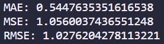

# Linear Regression: Predicting USA Housing Prices

## Description

In this project I used linear regression to create a model that would predict housing prices and then assessed the accuracy of those models using mean absolute error, mean squared error and root mean squared error. I created 2 models based one 2 different datasets: a fake USA housing dataset and a real california dataset from the 1990 US census. The technologies used were:

- python 
- sklearn
- pandas
- numpy
- seaborn
- matplotlib

Something I learnt was that even if e.g. a feature variable and the target have a strong positive correlation this does not mean that they will have a high coefficient as the magnitude of a coefficient isn't directly determined by the correlation. Instead it depends on the scale of the variables and the units they are measured in. However, you can expect that the corrificent will be positive if the correlation is positive.

Furthermore, working with real data got me remarkably better accuracy metrics as well as model coefficients that made sense.

## Installation

To install this project you will have to download the repository from github and runit locally from your CLI. To be able to use this project python will have to be installed, which can be found [here](https://www.python.org/downloads/).

## Usage

Once installed you can use this project by entering the repository location using your CLI. Once entered into the repository you can run the project by entering the following in the CLI:

1. Creating a virtual environment: ```python -m venv .venv```
2. Activating the virtual environment: ```source .venv/Scripts/activate```
3. Downloading all the required packages: ```pip install -r requirements.txt```
4. Running the file: ```python LinearRegression_FakeUSAData.py``` or ```python LinearRegression_RealCaliforniaData.py```

Once run graphs and metrics will show up similar to below:



